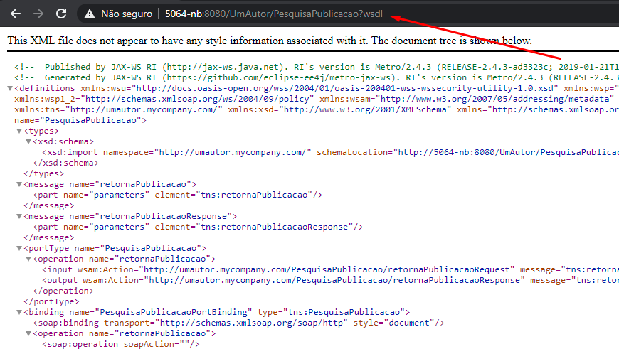
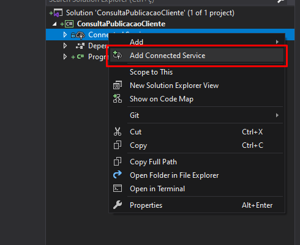
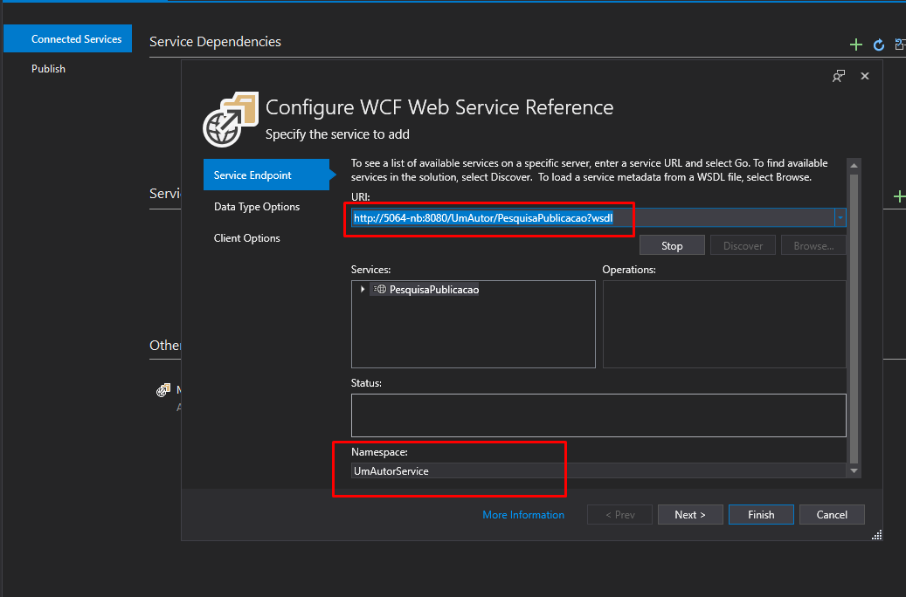
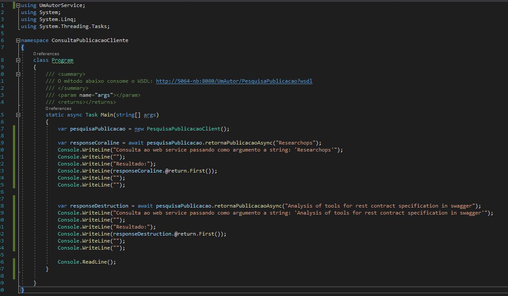
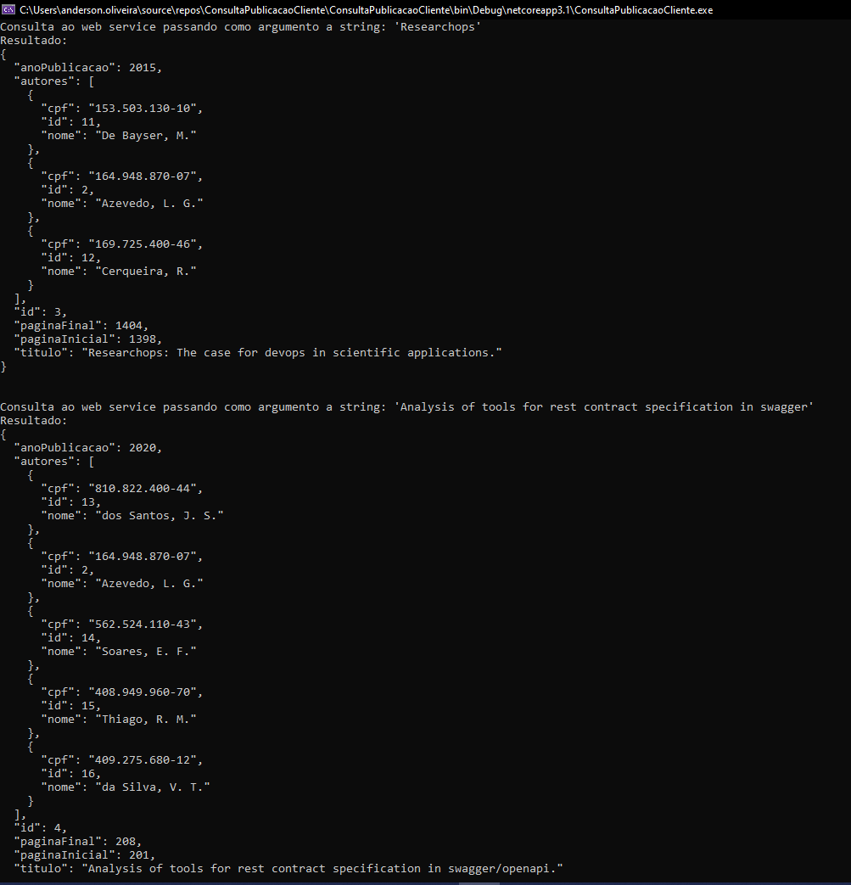

# Um Autor Cliente

## Rodar o app
- Para rodar o app é necessário instalar o <a href="https://dotnet.microsoft.com/download/dotnet/3.1">.NET Core SDK</a> >= 3.1;
- Garanta que o app servidor  **UmAutor** está disponibiliza o WSDL no endpoint: http://5064-nb:8080/UmAutor/PesquisaPublicacao?wsdl
- Utilizando o terminal navegue até a pasta ``ConsultaPublicacaoCliente`` e digite o comando: ``dotnet run``

## Passos de construção do app cliente
 Foi utilizado a linguagem C# com o framework .NET com intuito de interoperabilidade, construído na IDE Visual Studio.
 
 1. Url do WSDL disponibilizada 

 2. Realização da adição de um serviço via IDE  

 3. Realização da adição da referência e namespace 

 4. Após o scaffolding gerado pela IDE o serviço é disponibilizado como objeto para consumo 
 
 5. Print em tela console do resultado do consumo do serviço 